```mermaid
erDiagram
    direction LR

    auth_users {
        UUID id PK
        TEXT email
        TIMESTAMPTZ created_at
    }

    institution_organizations {
        UUID id PK
        TEXT name
        TEXT organization_type
        BOOLEAN is_verified
        TEXT operating_area_scope
        TIMESTAMPTZ created_at
    }

    areas {
        UUID id PK
        UUID parent_area_id FK
        TEXT name
        TEXT area_type
        TEXT iso_code
        BOOLEAN is_active
    }

    categories {
        UUID id PK
        TEXT slug
        TEXT display_name
        TEXT severity_hint
        BOOLEAN is_active
    }

    profiles {
        UUID id PK
        UUID organization_id FK
        UUID home_area_id FK
        TEXT role
        TEXT public_alias
        BOOLEAN anonymous_by_default
        TEXT preferred_language
        BOOLEAN onboarding_complete
        TIMESTAMPTZ created_at
        TIMESTAMPTZ deleted_at
    }

    posts {
        UUID id PK
        UUID author_id FK
        UUID category_id FK
        UUID area_id FK
        TEXT public_alias_snapshot
        TEXT description
        TEXT source_language
        TEXT display_language
        TEXT visibility
        TEXT workflow_status
        TEXT enrichment_status
        DECIMAL latitude
        DECIMAL longitude
        TEXT sanitized_area_label
        NUMERIC priority_score
        BOOLEAN is_anonymous
        TIMESTAMPTZ created_at
        TIMESTAMPTZ updated_at
    }

    post_media {
        UUID id PK
        UUID post_id FK
        TEXT storage_bucket
        TEXT storage_path
        TEXT media_type
        TEXT moderation_state
        TIMESTAMPTZ created_at
    }

    post_ai_assessments {
        UUID id PK
        UUID post_id FK
        TEXT enrichment_status
        TEXT severity_level
        TEXT complexity_level
        TEXT summary
        TEXT translated_text
        TEXT[] hazard_tags
        NUMERIC confidence_score
        TEXT model_provider
        TEXT model_version
        TIMESTAMPTZ processed_at
    }

    post_comments {
        UUID id PK
        UUID post_id FK
        UUID author_id FK
        TEXT public_alias_snapshot
        TEXT body
        BOOLEAN is_deleted
        TIMESTAMPTZ created_at
    }

    post_raises {
        UUID id PK
        UUID post_id FK
        UUID user_id FK
        TIMESTAMPTZ created_at
    }

    post_follows {
        UUID id PK
        UUID post_id FK
        UUID user_id FK
        TIMESTAMPTZ created_at
    }

    post_reports {
        UUID id PK
        UUID post_id FK
        UUID reporter_id FK
        TEXT reason_code
        TEXT notes
        TEXT review_status
        TIMESTAMPTZ created_at
    }

    post_status_history {
        UUID id PK
        UUID post_id FK
        UUID changed_by_profile_id FK
        TEXT from_status
        TEXT to_status
        TEXT change_reason
        TIMESTAMPTZ created_at
    }

    institution_case_views {
        UUID id PK
        UUID post_id FK
        UUID profile_id FK
        UUID organization_id FK
        TEXT case_status
        TEXT response_notes
        TIMESTAMPTZ last_viewed_at
        TIMESTAMPTZ updated_at
    }

    daily_post_summaries {
        UUID id PK
        DATE summary_date
        UUID area_id FK
        UUID category_id FK
        TEXT workflow_status
        TEXT severity_level
        INTEGER total_posts
        INTEGER unresolved_posts
        INTEGER high_priority_posts
    }

    auth_users ||--|| profiles : owns
    institution_organizations ||--o{ profiles : includes
    areas ||--o{ areas : nests
    areas ||--o{ profiles : homes
    categories ||--o{ posts : classifies
    areas ||--o{ posts : scopes
    profiles ||--o{ posts : authors
    posts ||--o{ post_media : attaches
    posts ||--|| post_ai_assessments : enriches
    posts ||--o{ post_comments : receives
    profiles ||--o{ post_comments : writes
    posts ||--o{ post_raises : receives
    profiles ||--o{ post_raises : performs
    posts ||--o{ post_follows : receives
    profiles ||--o{ post_follows : performs
    posts ||--o{ post_reports : receives
    profiles ||--o{ post_reports : files
    posts ||--o{ post_status_history : tracks
    profiles ||--o{ post_status_history : updates
    posts ||--o{ institution_case_views : triages
    profiles ||--o{ institution_case_views : reviews
    institution_organizations ||--o{ institution_case_views : manages
    areas ||--o{ daily_post_summaries : aggregates
    categories ||--o{ daily_post_summaries : aggregates
```

## Notes

- `auth_users` represents Supabase Auth identities and is managed by Supabase.
- `posts.latitude` and `posts.longitude` are sensitive and should never be exposed by public APIs.
- `post_ai_assessments` is system-managed and updated by asynchronous enrichment jobs.
- `profiles.role` drives responder capabilities:
  - `ngo_staff` can maintain organization-scoped case status and response notes
  - `government_staff` can additionally update public post workflow status
  - `admin` can additionally review abuse reports and reassign institution ownership
- `post_reports.review_status` should support at least `pending_review`, `dismissed`, `actioned`, and `escalated`.
- `institution_case_views` should be keyed operationally by `(post_id, organization_id)` even if the physical uniqueness rule is added later.
- `daily_post_summaries` can be implemented as a physical table refreshed by workers or as a materialized view, depending on operational needs.
- If stored as a table, enforce uniqueness on `(summary_date, area_id, category_id, workflow_status, severity_level)`.
- `post_raises` should enforce one active raise per `(post_id, user_id)` pair.
- `post_follows` should enforce one active follow per `(post_id, user_id)` pair.
- No extra table is required for `Open thread` because it reads the existing `posts` and `post_comments` records.
- No extra table is required for `Share context` when it is implemented as a deep-link into the existing comment composer.
