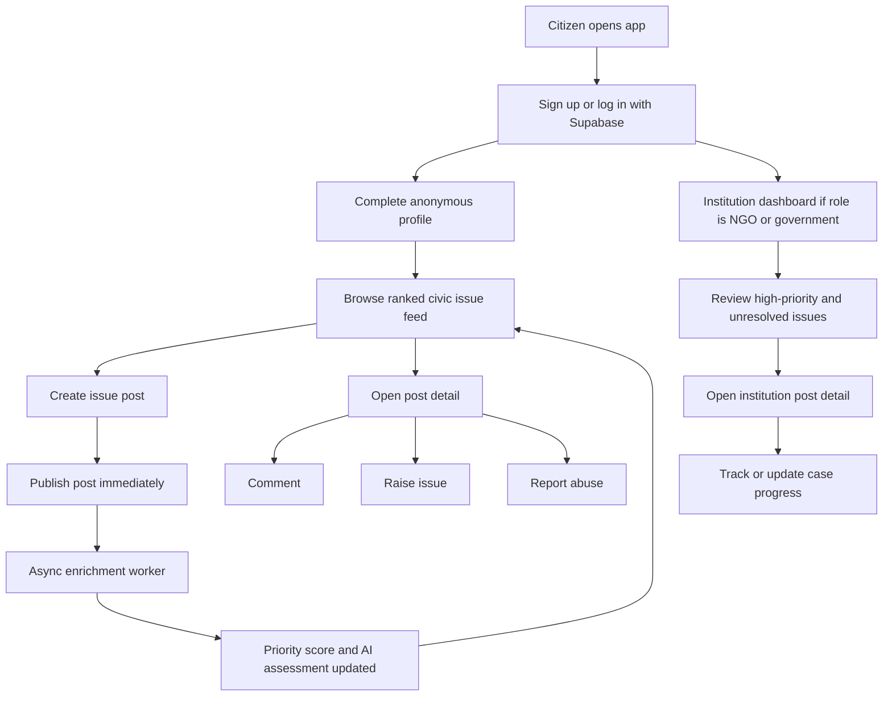
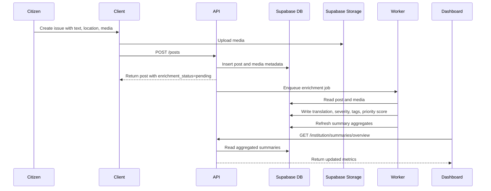

# User Flows

## High-Level Journey

## Citizen Flow

1. A citizen signs up or logs in through Supabase.
2. The app prompts for a public alias, preferred language, anonymity default, and optional home area.
3. The citizen lands on a ranked feed tailored by locality, engagement, and issue priority.
4. When creating a post, the citizen can:
   - type a description
   - dictate with speech-to-text
   - choose a category
   - attach media
   - allow auto-detect location or select a location manually
   - translate to English or a local language if needed
5. The post is saved immediately with `enrichment_status = pending`.
6. The citizen can return to the feed, open the post detail page, comment, raise, or report other content.
7. The public version of the post shows only a sanitized area label and anonymous alias snapshot.

## Institution Flow

1. NGO and government users authenticate through the same Supabase flow.
2. The backend verifies that their profile has an institution role and a verified organization relationship.
3. Institution users land on a dashboard that highlights:
   - unresolved issues
   - high-priority issues
   - summaries by area, category, and severity
   - recent spikes in specific localities
4. Opening a post from the dashboard shows institution-only detail such as exact coordinates, severity breakdown, moderation flags, and case-tracking metadata.
5. Institution users can triage, acknowledge, or follow the issue through an operational workflow backed by status history and case-tracking tables.

## System And Worker Flow

## Important Journey Rules

- Posting must not wait for AI completion.
- Translation and speech-to-text improve accessibility but remain optional.
- Public feeds and detail pages must never expose exact coordinates.
- Institution dashboards can use exact coordinates only after authorization checks pass.
- Reports are moderation actions and must not directly change civic issue severity.
